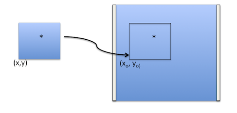

.. _sub2full:

sub2full
========

.. automodapi:: wfc3tools.sub2full

More information on header keywords
-----------------------------------

The task uses header keywords from the SPT file of the associated image in order to calculate the offset for the subarray.
The keywords it uses are:

=========  ====================================
Keyword    Meaning
=========  ====================================
SS_DTCTR   To get the detector for the image
SS_SUBAR   To make sure the image is a subarray
XCORNER    The x corner of the subarray
YCORNER    The y corner of the subarray
NUMROWS    Subarray x size
NUMCOLS    Subarray y size
=========  ====================================

The  UVIS full frame detector has 2051 rows, with 25 pixels of serial overscan.
The IR detector has 1024 rows and 5 pixels of overscan.
